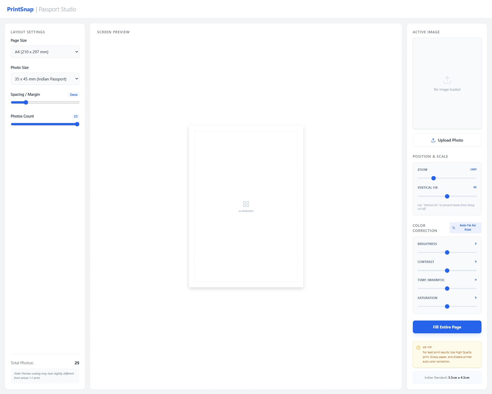

<div align="center">

</div>

# PrintSnap | Passport Studio

PrintSnap is a robust, client-side React web application designed for generating perfect passport-sized photo grids ready for professional printing. Stop relying on expensive studio software and use this high-precision Layout & Color Correction studio directly from your browser. 

## ✨ Key Features

- **Standard & Custom Dimensions**: 
  - One-click Indian Passport standard sizing (`35mm x 45mm`).
  - *Custom Size (cm)*: Enter specific physical dimensions.
  - *Custom Resolution*: Formulate exact physical sizes using pixels and DPI directly.
- **Smart Matrix Generation**: Auto-calculates exactly how many photographs can cleanly fit onto an A4 layout block using calculated margins and spacing.
- **High-Fidelity Zoom & Pan**: Easily scale up images and rely on the "Vertical Fix" slider to center heads without awkwardly clipping them out of the framing.
- **Pre-Print Color Studio**: Comprehensive color enhancements mapped accurately across screen and print environments. Includes Brightness, Contrast, Temperature (Warmth), and Saturation sliders alongside an intelligent **Auto Fix for Print** algorithm.
- **Crisp 300 DPI High-Res Export**: Generates an invisible off-screen 300 DPI Canvas that flawlessly duplicates CSS-driven filters globally into an ultra-high quality JPEG (`image/jpeg 1.0` grade) ready for kiosk/photo-lab transfer.
- **Browser-Native Printing**: Honors hard-coded `@media print` rules enforcing precise dimensions, cut lines, and webkit strict color adjustments bypassing generic OS filters.

## 🛠 Tech Stack

- **Framework**: [Next-Gen React](https://react.dev) + [Vite](https://vitejs.dev/)
- **Styling**: [Tailwind CSS v4](https://tailwindcss.com/) for a sleek, glassmorphic layout.
- **Icons**: [Lucide React](https://lucide.dev/)
- **Animation**: [Motion (Framer Motion)](https://motion.dev/)

## 🚀 Getting Started

To run PrintSnap locally on your machine:

**Prerequisites:** Node.js (v18+ recommended)

1. **Install dependencies**
   ```bash
   npm install
   ```

2. **Run the development server**
   ```bash
   npm run dev
   ```

3. **Open the App**
   Open your browser and navigate to the local server URL provided in the terminal (usually `http://localhost:9000`).

---

### 🖨️ Pro Printing Tips
For the best possible passport photo outcome:
1. Always use **High Quality** print settings.
2. Select **Glossy Photo Paper** on your printer profile.
3. Turn **OFF** software Auto Color Correction inside your OS/Printer properties to allow PrintSnap's exact pre-print algorithms to function flawlessly.
